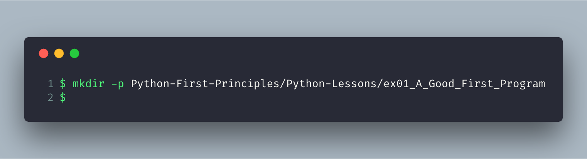
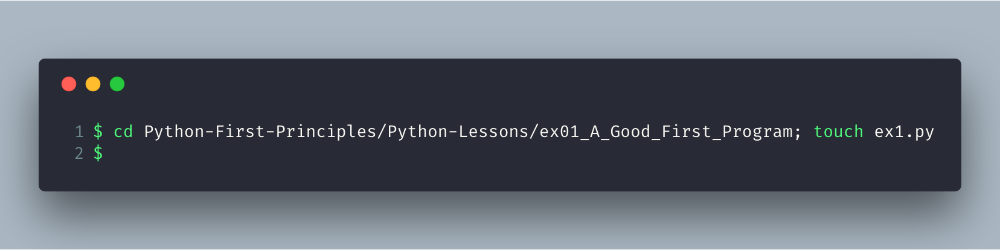
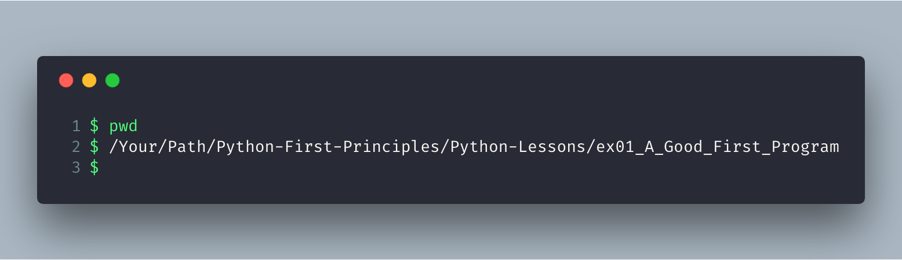
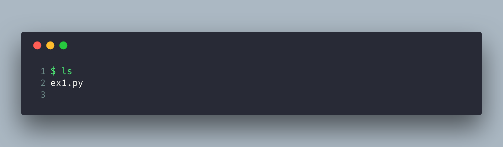
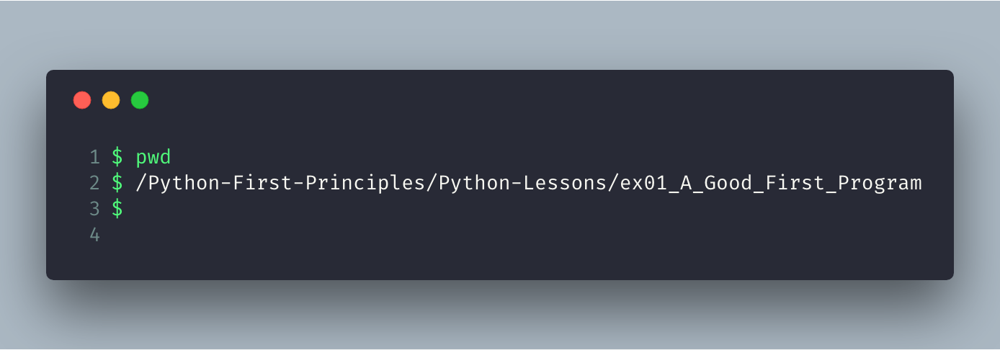
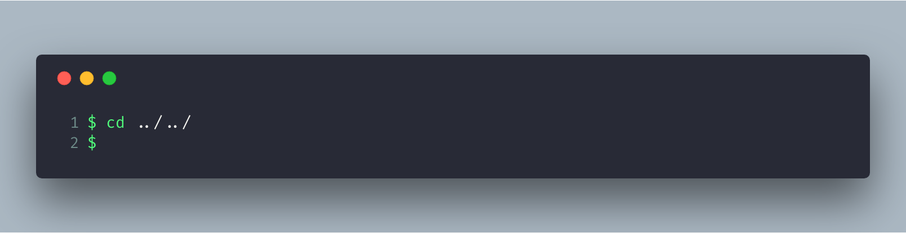
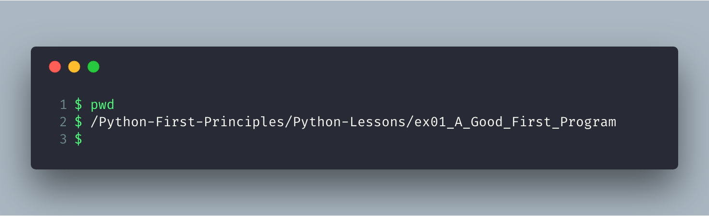
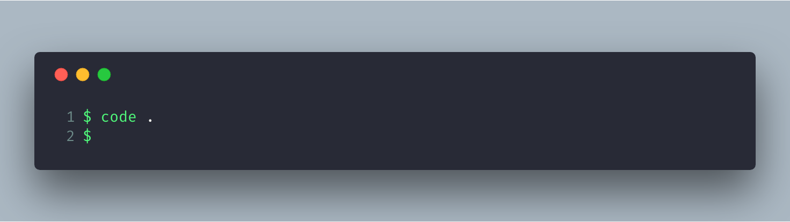
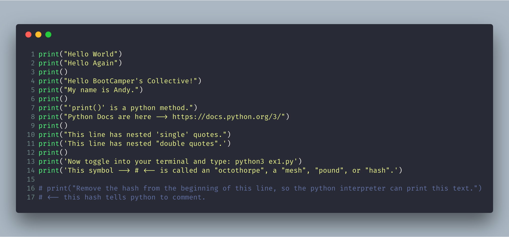
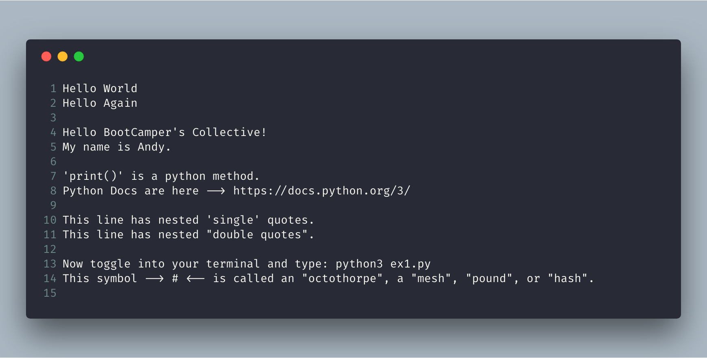

# Exercise 1: A Good First Program

## 1. Create project files & folders

From your terminal, make a project directory named `Python-First-Principles`, and create a `path` using the `-p` flag to nest another directory called `Python-Lessons` with a directory nesting in there called `ex01_A_Good_First_Program`.

Now `cd` down into `ex01_A_Good_First_Program` and create a file named `ex1.py` using the `touch` command and the `;` semi-colon _chain-command_ operator.

What you just did is **changed directory** down into `ex01_A_Good_First_Program`, then **chained** the `touch ex1.py` command by using a `;` _chain-command_ operation.

Once again the `touch` command creates files.

Now if you're not sure what directory you're currently in, type `pwd`. This stands for **print working directory**. And if you do so, you should see :point\_down:

Now that you're in `ex01_A_Good_First_Program` you may confirm that `ex1.py` was created by typing the **list** command :point\_down:

### Let's Review

1. We enter the `terminal`.
2. We create our project directories using `mkdir` with a `-p` flag for _folder-path_.
3. We create or `touch` our python file \(`ex1.py`\).
4. We confirm which directory we are in with `pwd`.
5. We run **list** to confirm the creation of our python file.

## 2. Writing our first Python script

From the terminal we are still in `ex01_A_Good_First_Program`.

Let's change directory up two levels to `Python-First-Principles`.

But first, let's `pwd` to confirm our location.

Good! Now we can `cd` up two levels using the following:

The `..` means to "_go up one directory_", and we separate the dots with a `/` to tell the terminal "_this is a directory_".

And if we `pwd` we should be see this:

### Open folder in editor

There are many ways to open our project folder from the editor of our choosing. I'll open it in **VSCode**.

From our current location this _should_ open up `Python-First-Principles` . If it doesn't work for you, don't worry. We can configure it later.

### Start Scripting

Let's make a couple print statements:

Notice line 9 tells us how to run the script from the terminal \(`$ python3 ex1.py`\). This is how we will be checking and running most of our programs. Let's give a try.

#### What You Should See

#### Next Steps

* Go over each line backwards from the bottom up, and speak out loud what each line is doing. It seems strange yet this practice will help you _intuit_ how the code is executing and help you detect bugs before they start.