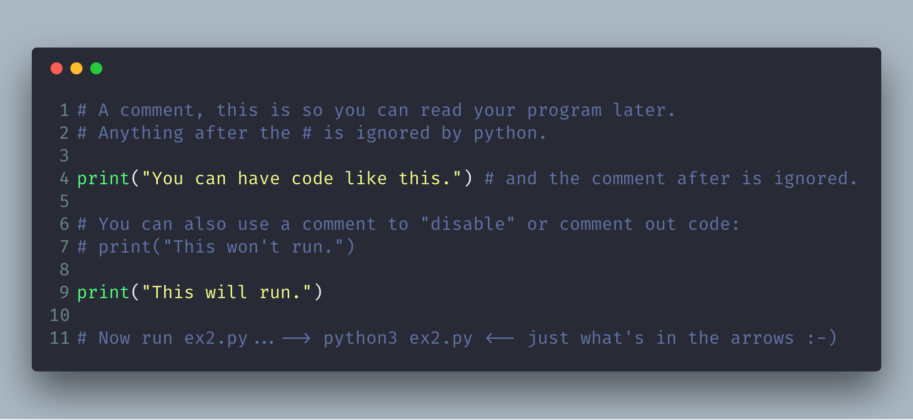

# Exercise 2: Comments and Pound Characters

## 1. Create project files & folders (again)

For a review of how to create your files see [Exercise 1](lessons/ex01.md).

## 2. Start Scripting

After typing this code in our `ex02.py` file, we can now run the following command in terminal:
 - `$ python3 ex02.py`

## 3. What You Should See

## 4. Common Student Questions

**Are you sure # is called the pound character?**

- I call it the octothorpe because that is the only name that no country uses and that works in every country. Every country thinks its name for this one character is both the most important way to do it and the only way it's done. To me this is simply arrogance and, really, y'all should just chill out and focus on more important things like learning to code.

**If # is for comments, then how come # -*- coding: utf-8 -*- works?**

- Python still ignores that as code, but it's used as a kind of "hack" or workaround for problems with setting and detecting the format of a file. You also find a similar kind of comment for editor settings.

**Why does the # in print "Hi # there." not get ignored?**

- The # in that code is inside a string, so it will be put into the string until the ending " character is hit. These pound characters are just considered characters and aren't considered comments.

**How do I comment out multiple lines?**

- Put a # in front of each one.

**I can't figure out how to type a # character on my country's keyboard?**

- Some countries use the Alt key and combinations of other keys to print characters foreign to their language. You'll have to look online in a search engine to see how to type it.

**Why do I have to read code backward?**

- It's a trick to make your brain not attach meaning to each part of the code, and doing that makes you process each piece exactly. This catches errors and is a handy error-checking technique.