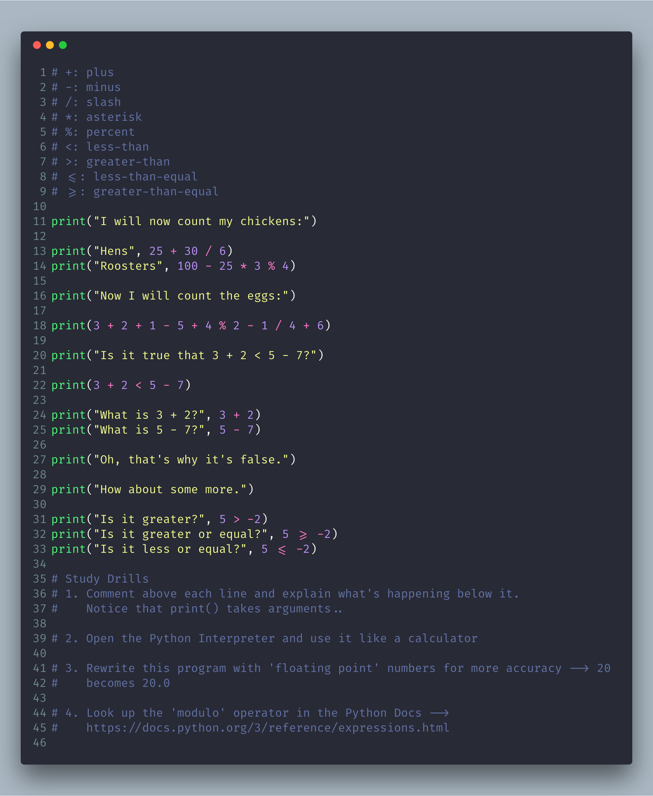
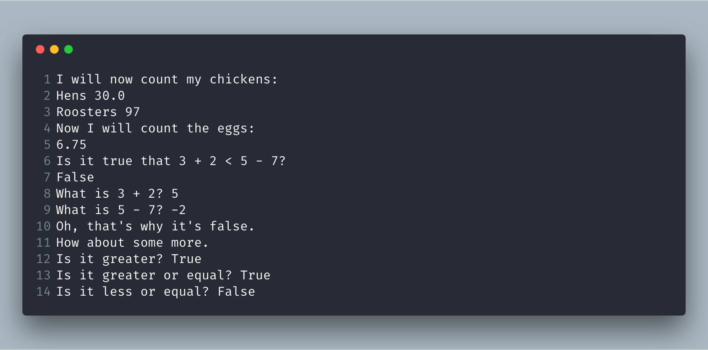

# Exercise 3: Numbers and Math

From this point forward I'm not going to tell you to make a new directory and `touch` `ex03.py`
even though I just sort of did.. :neckbeard:

## Type this in

## What you should see

## Common Student Questions

**Why is the % character a "modulus" and not a "percent"?**

- Mostly that's just how the designers chose to use that symbol. In normal writing you are correct to read it as a "percent." In programming this calculation is typically done with simple division and the / operator. The % modulus is a different operation that just happens to use the % symbol.

**How does % work?**

- Another way to say it is, "X divided by Y with J remaining." For example, "100 divided by 16 with 4 remaining." The result of % is the J part, or the remaining part.

**What is the order of operations?**

- In the United States we use an acronym called PEMDAS which stands for Parentheses Exponents Multiplication Division Addition Subtraction. That's the order Python follows as well. The mistake people make with PEMDAS is to think this is a strict order, as in "Do P, then E, then M, then D, then A, then S." The actual order is you do the multiplication and division (M&D) in one step, from left to right, then you do the addition and subtraction in one step from left to right. So, you could rewrite PEMDAS as PE(M&D)(A&S)