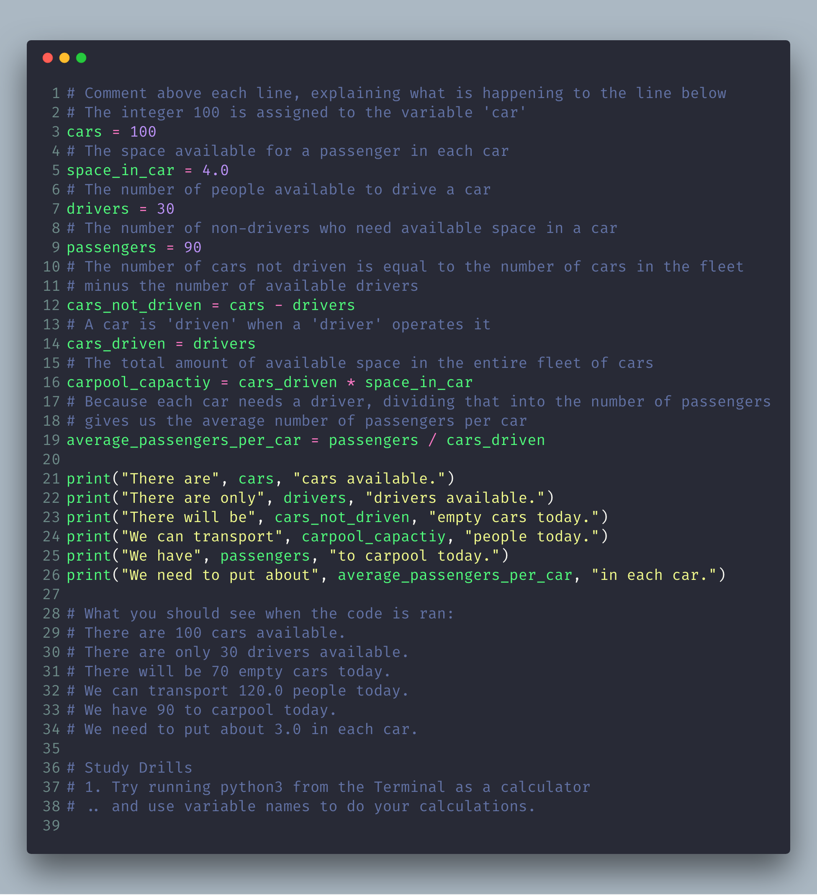
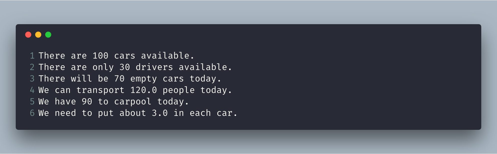

# Exercise 4: Variables and Names

Now you can print things with print and you can do math. The next step is to learn about variables. In programming a variable is nothing more than a name for something, similar to how my name "Andy" is a name for, "The human who is writing this.."

More exact, a variable is an allocation in memory by which to refer to something else.
The variable `name` my store the data type of string, `"Andy"` to an area in memory for later use.

## Type this




## What You Should See



## Study Drills

When I wrote this program the first time I had a mistake, and Python told me about it like this:

```bash
Traceback (most recent call last):
  File "ex4.py", line 8, in <module>
    average_passengers_per_car = car_pool_capacity / passenger
NameError: name 'car_pool_capacity' is not defined
```

## Common Student Questions

**What is the difference between = (single-equal) and == (double-equal)?**

- The = (single-equal) assigns the value on the right to a variable on the left. The == (double-equal) tests if two things have the same value. You'll learn about this in Exercise 27.

**Can we write x=100 instead of x = 100?**

- You can, but it's bad form. You should add space around operators like this so that it's easier to read.

**How can I print without spaces between words in print?**

- You do it like this: print "Hey %s there." % "you". You will do more of this soon.

**What do you mean by "read the file backward"?**

- Very simple. Imagine you have a file with 16 lines of code in it. Start at line 16, and compare it to my file at line 16. Then do it again for 15, and so on until you've read the whole file backward.

**Why did you use 4.0 for space_in_a_car?**

- It is mostly so you can then find out what a floating point number is and ask this question. See the Study Drills.
