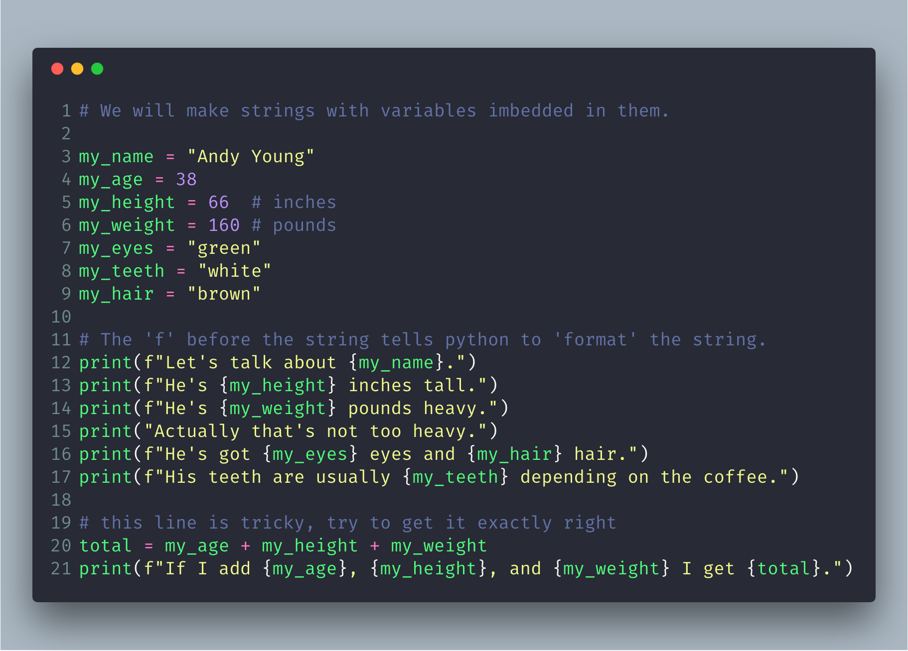
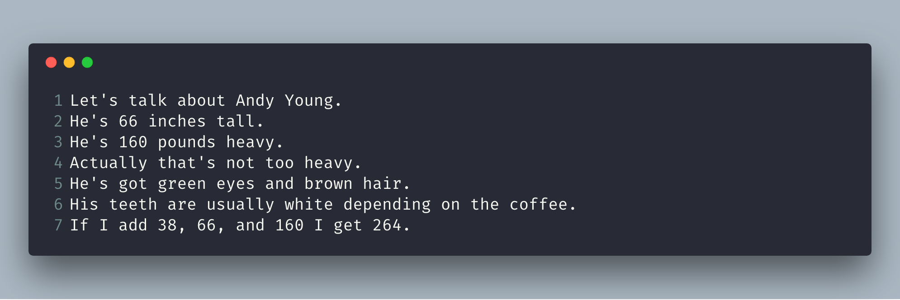

# More Variables and Printing

Now we'll do even more typing of variables and printing them out. This time we'll use something called a "format string." Every time you put `"` (double-quotes) around a piece of text you have been making a string. A string is how you make something that your program might give to a human. You print strings, save strings to files, send strings to web servers, and many other things.

Strings are really handy, so in this exercise you will learn how to make strings that have variables embedded in them. You embed variables inside a string by using a special `{}` sequence and then putting the variable you want inside the `{}` characters. You also must start the string with the letter `f` for "format" as in `f"Hello {somevar}"`. This little `f` before the `"` (double-quote) and the `{}` characters tells Python3, "Hey, this string needs to be formatted. Put these variables in there."

As usual, just type this in even if you do not understand it and make it exactly the same.

## What You Should See

