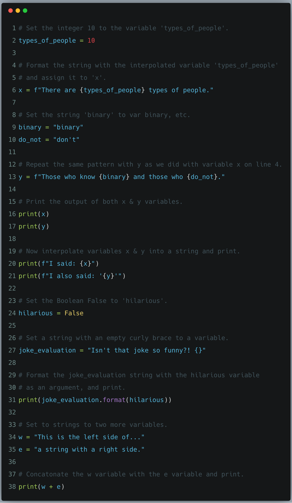
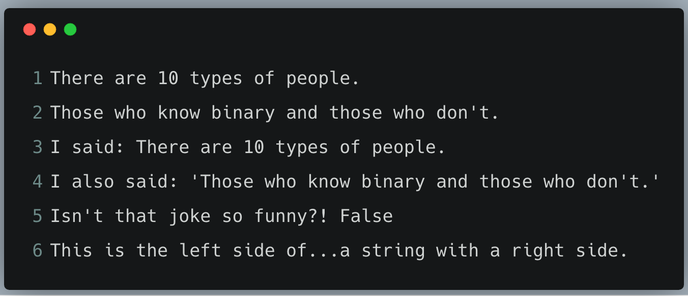

# Strings and Text

In this exercise we create a bunch of variables with complex strings so you can
see what they are for. First an explanation of strings..

A string is usually a bit of text you want to display to someone or 'export' out of the program
you are writing. Python knows you want something to be a string when you put either `"` (double quotes)
or `'` (single quotes) around the text.

In the code for this exercise `types_of_people = 10` creates a variable named `types_of_people`
and sets it = (equal) to `10`. You can put that in any string with `{types_of_people}`.
You also see that I have to use a special type of string "format", it's called an "f-string" and looks like this:

```python
f"some stuff here {a_variable}
f"some other stuff {another_variable}
```

Python _also_ has another kind of formatting using the `.format()` syntax, which you see on line 31.



## What You Should See

