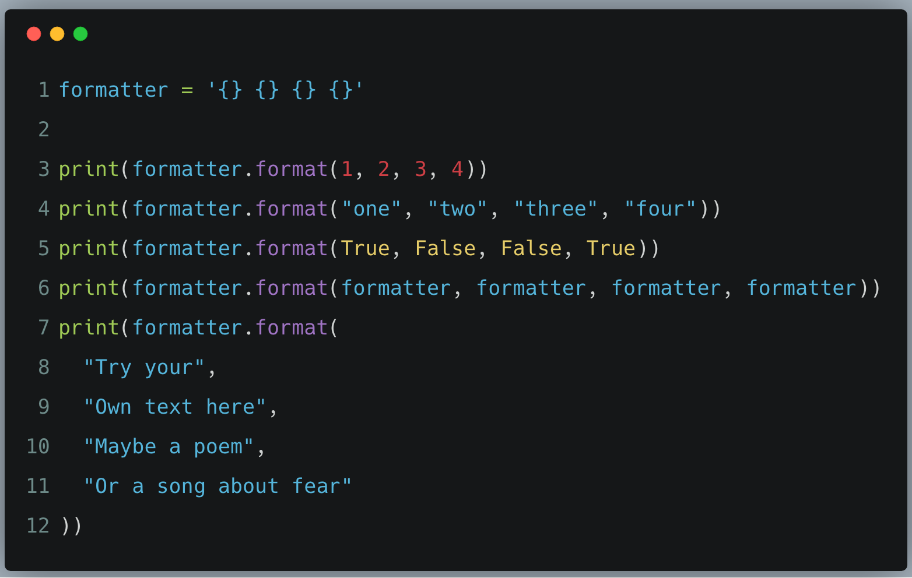
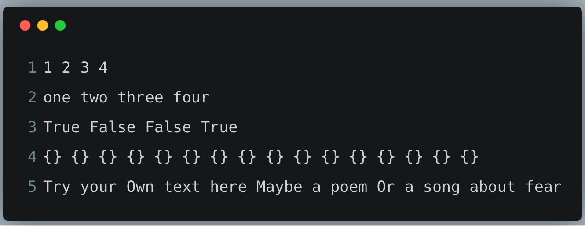

# Printing, Printing

We will now do a more complicated formatting of a string. This code looks complex, yet
it you write comments above each line and break each thing down to its parts, you'll
understand it.

## What You Should See

In this exercise I'm using a _function_ to turn the `formatter` variable into other strings.
When you see `formatter.format(...)` we are telling python to do the following:

1. Take the `formatter` string defined on line 1.
2. Call its `format` function, which is similar to telling it to do a command line command named `format`.
3. Pass to `format` four arguments, which match up with the four `{}`s in the `formatter` variable. This is like passing arguments to the command line command `format`.
4. The result of calling `format` on `formatter` is a new string that has the `{}` replaced with the four variables. This is what `print` is now printing out.

### Keep Up The Good Work

It's ok if you don't fully understand what's happening. We'll cover the mystery areas in the following exercises.