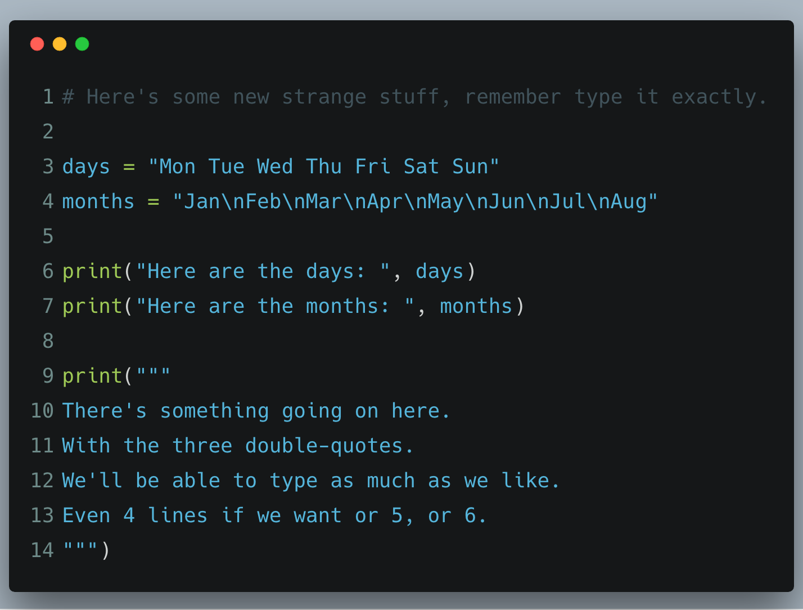
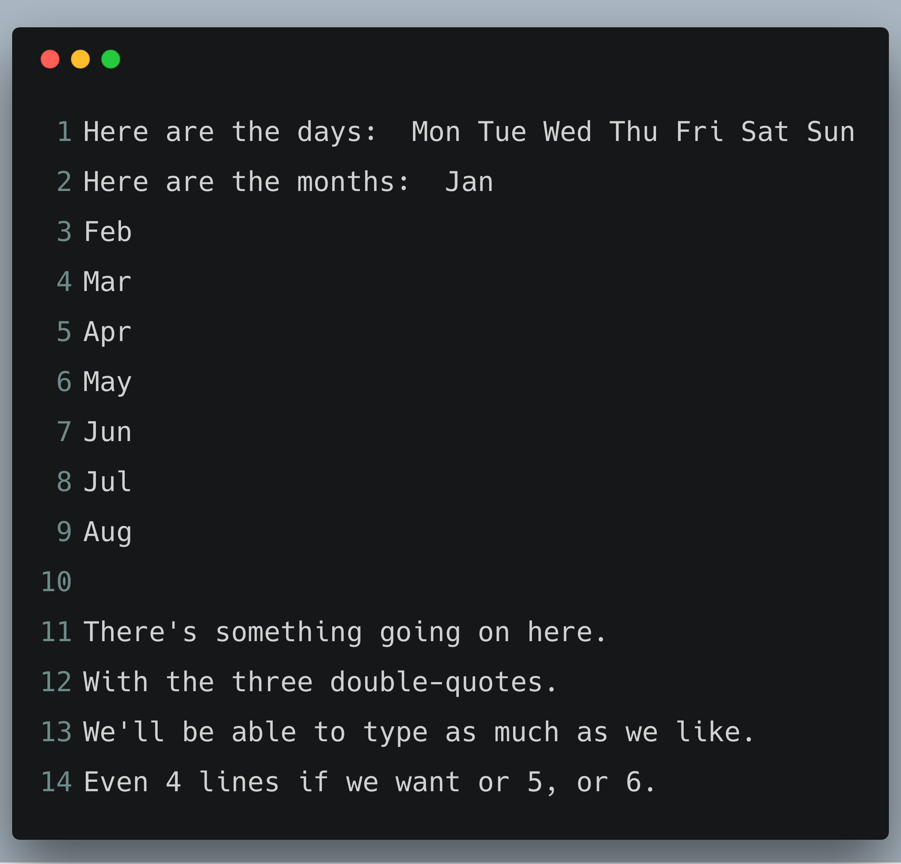

# Exercise 9: Printing, Printing, Printing

By now you see the method behind this madness. We do the thing first, then explain what's going on.
In my opinion, we get more out of learning code by first experiencing _the doing_, then talk about it,
then repeat the process with another new & mysterious bit mixed in what we just learned.

## What You Should See

Keep going, you're doing great 💪🏻