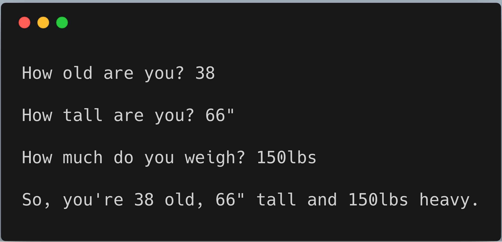

# Exercise 11: Asking Questions

Most of what software does is:

1. Takes input from a person

1. Changes it

1. Prints out something to show how it changed

## Code it out

## What you should see

