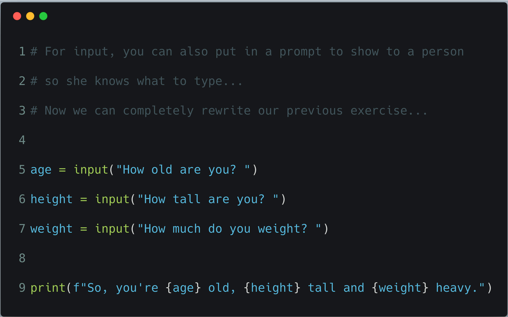
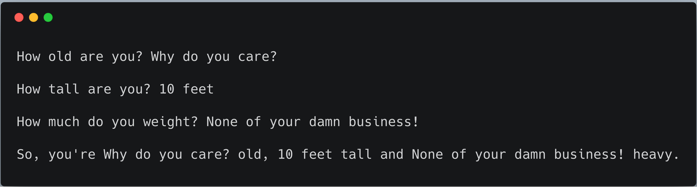

# Exercise 12: Prompting People

For **input** you can also put in a prompt to show to a person so he knows what to type.
Put a string that you want for the prompt inside the `()` so that it looks like this:

```python
y = input("Name? ")
```

This prompts the user with "Name?" and puts the result into the variable `y`.
This means we can completely rewrite our previous exercise using just `input` to do all the prompting.

## Code it out



## What you should see

