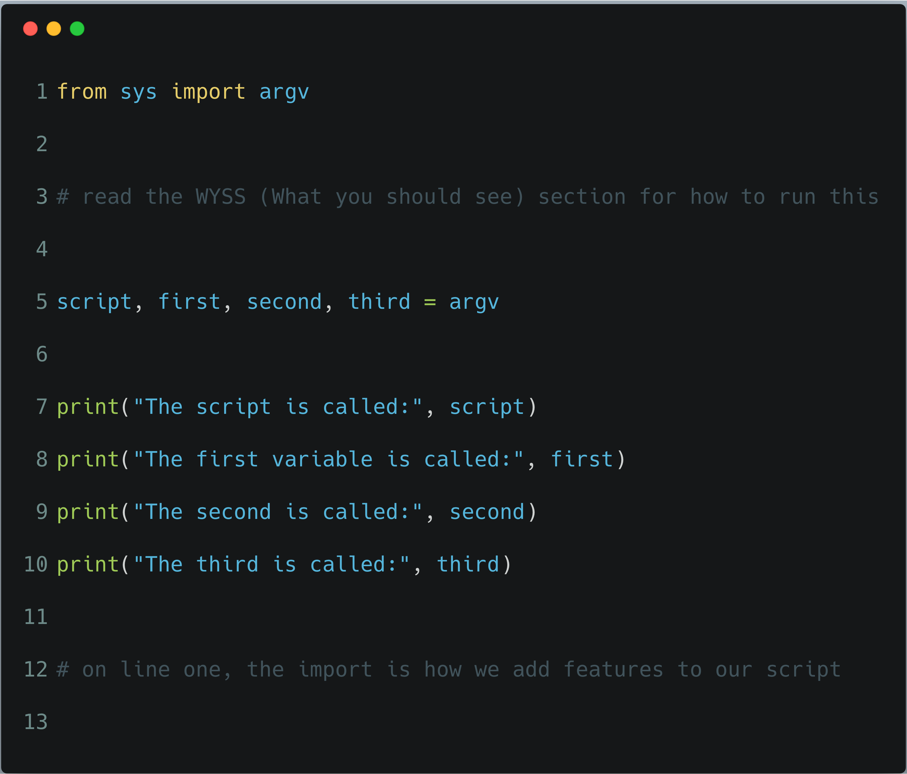
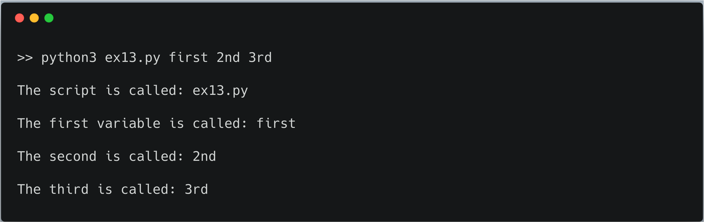

# Parameters, Unpacking, Variables

In this exercise we will cover one more input method you can use to pass variables to a script
(_script_ being another name for your `.py` files).

You know how you type `python3 ex13.py` or `python3.6 ex13.py` to run the **ex13.py** file?
Well  the `ex13.py` part of the command is an _**argument**_.

What we'll do now is write a script that also accepts _**more**_ arguments.

## Code it out



## What you should see

> ⚠️ **WARNING**️️️️️️ We have been running python scripts without command-line arguments. If we type only `python3.6 ex13.py` we are _doing it wrong_. This applies any time we see `argv` being used.

Run the program like this (and you _must_ pass _**three**_ command line arguments):

```bash
> python3.6 ex13.py first 2nd 3rd
```

### The output of `python3.6 ex13.py first 2nd 3rd`:

