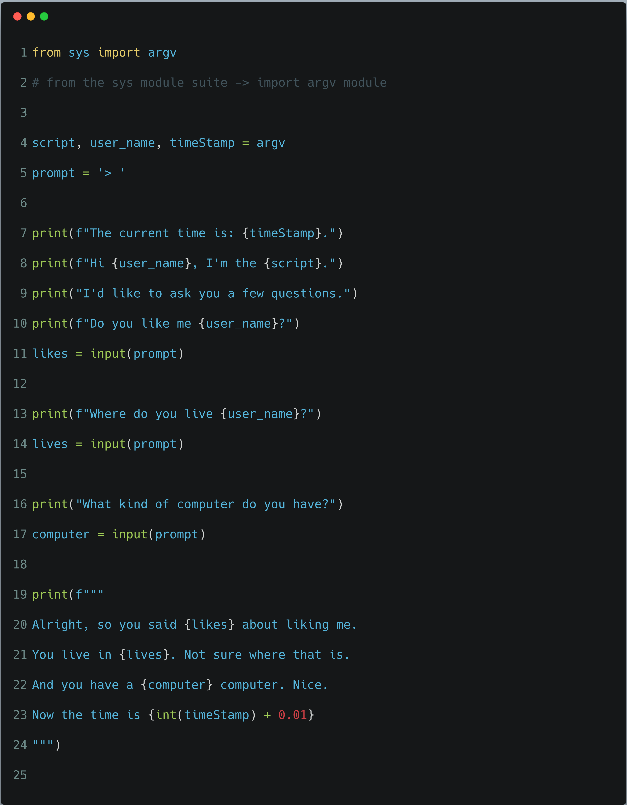
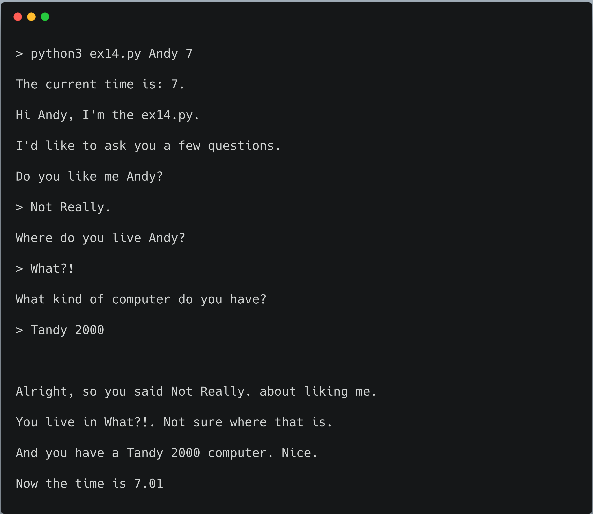

# Exercise 14: Prompting and Passing

Let's do another exercise that uses `argv` and `input` together to ask the user something specific.
You will need this for the next exercise where we learn to read and write files. In this exercise we'll
use `input` slightly differently by having it print a simple `>` prompt.. similar to text based games.

## Code it out

We make a variable, `prompt`, that is set to the prompt we want, and we give that to `input` instead of
typing it over and over. Now if we want to make the prompt something else, we just change it in this one spot and rerun the script.

## What you should see

