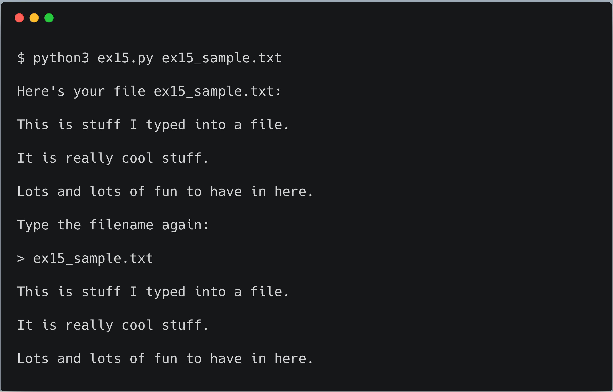

# Exercise 15: Reading Files

You know how to get input from a user with `input` and `argv`. Now we will learn about
reading from a file. Working with files is an easy way to _erase your work_ if we're not careful.

This exercise involves writing two files:

1. `ex15.py`

1. `ex15_sample.txt` (This is just a plain text file we will read from `ex15.py`.)

Type this into `ex15_sample.txt`:

```text
This is stuff I typed into a file.
It is really cool stuff.
Lots and lots of fun to have in here.
```

Our goal is to _**open**_ that file in our script and print it out.
The solution is to use `argv` or  `input` to ask the user what file to open instead of hard coding the file's name.

## Code it out


## What's all this new stuff?

- Lines 1--3 use `argv` to get a filename.

  - Line 5 we use a new command [open](https://docs.python.org/3/library/functions.html#open).
    - `open` takes a parameter and returns a value you can set to your own variable.

- Line 8 calls a function on `txt` named [read](https://docs.python.org/3/tutorial/inputoutput.html).

  - What we get back from `open` is a `file`, and it also has a command you can give it.
  - You give a file a command by using the `.` (dot or period), then..
    - ..the name of the command, and any parameters, just like with `open` and `input`.

The difference is that `txt.read()` says,
> "Hey `txt`! Do your `.read()` command with no parameters!"

## What you should see

